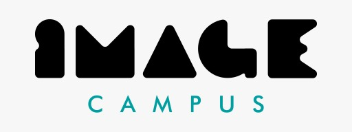

# School-s-Out-
¡Lucha por tu nota, derrota a tus compañeros y aprueba tus finales!

# School's Out!!

Un juego de lucha basado en proyectiles, ambientado en una escuela secundaria donde los estudiantes luchan entre sí para vencer a sus maestros primero para aprobar sus exámenes.

Juega como Aki, un estudiante decidido a aprobar todos sus exámenes y dejar atrás la vida escolar para perseguir sus sueños. 

¡Derrota a tus enemigos estudiantes lanzando tus varios útiles escolares y tu botella de soda expirada para explotar a sus pies! Esquiva saltando o agachándose por encima y debajo de los ataques enemigos, o defiendete cuando sea necesario, ¡pero ten cuidado con tu Stamina! 

¡Jugá contra la computadora en el Modo Historia o Modo Supervivencia, o también lucha contra tus amigos en el modo Multijugador!

This is a game (demo/protoype/vertical slice) developed by students from <a href="https://www.imagecampus.edu.ar/">Image Campus</a>

   

## Credits

- **Theo Leyenda** - *Programming* -     
- **Lautaro Mosquera** - *Art* -     
- **Gianluca Mascaro** - *Art* -     
- **Facundo gerboles** - *Art* -     
- **Maximiliano Duarte** - *Audio* -     
- **Mauricio Bosso** - *Audio* -     
- **Tomas Pereyra** - *Testing* -     
- **Leonardo Fernandez** - *Testing* -     

This game was also possible thanks to the support of these professors:

- **Sergio Baretto**
- **Federico Barra**
- **Jorge Cuéllar**
- **Fernando Puig**
- **Eugenio Taboada**

## Links

Download it from itch.io: https://lqngames.itch.io/under-control
